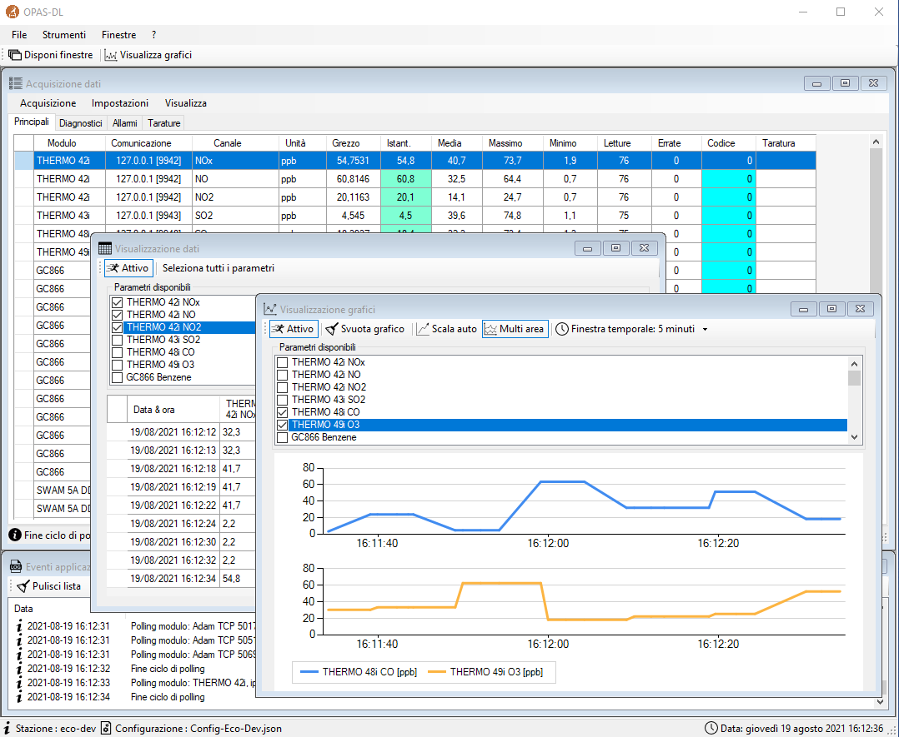</img>

# OPAS-DL – OPAS-TOOLS V 1.50 <br> Manuale d’uso

## Open Air System

***Progetto Open Source*** <br> dedicato alla gestione di sistemi di monitoraggio ambientale

##### Ultimo aggiornamento: Settembre 2021

<br>
<br>
<br>
<br>
<br>

### Sommario

* [PREMESSA](#premessa)

1. [FUNZIONALITA’ E ACQUISIZIONE](#1-funzionalità-e-acquisizione)

    1.1 [Avvio del sistema](#11-avvio-del-sistema)<br>
    1.2 [Manipolazione dei dati acquisiti](#12-manipolazione-dei-dati-acquisiti)

2. [LE DIRECTORY DEL PROGRAMMA](#2-le-directory-del-programma)

    2.1 [Schema delle directory](#21-schema-delle-directory)<br>
    2.2 [Directory delle funzionalità di supporto](#23-directory-delle-funzionalità-di-supporto)<br>
    2.3 [Directory per i dati](#23-directory-per-i-dati)

3. [OPAS-TOOLS](#3-opas-tools)

    3.1 [File - Configurazione](#31-file---configurazione)<br>

    &nbsp;&nbsp;&nbsp;&nbsp;&nbsp;&nbsp;&nbsp;&nbsp;&nbsp;&nbsp;3.1.1 [I menù](#311-i-menù)<br>
    &nbsp;&nbsp;&nbsp;&nbsp;&nbsp;&nbsp;&nbsp;&nbsp;&nbsp;&nbsp;&nbsp;&nbsp;&nbsp;&nbsp;&nbsp;&nbsp;&nbsp;&nbsp;&nbsp;&nbsp;* [Menù *File*](#menù-file)<br>
    &nbsp;&nbsp;&nbsp;&nbsp;&nbsp;&nbsp;&nbsp;&nbsp;&nbsp;&nbsp;&nbsp;&nbsp;&nbsp;&nbsp;&nbsp;&nbsp;&nbsp;&nbsp;&nbsp;&nbsp;* [Menù *Moduli*](#menù-moduli)<br>
    &nbsp;&nbsp;&nbsp;&nbsp;&nbsp;&nbsp;&nbsp;&nbsp;&nbsp;&nbsp;&nbsp;&nbsp;&nbsp;&nbsp;&nbsp;&nbsp;&nbsp;&nbsp;&nbsp;&nbsp;* [Menù *Proprietà Moduli*](#menù-proprietà-moduli)<br>
    &nbsp;&nbsp;&nbsp;&nbsp;&nbsp;&nbsp;&nbsp;&nbsp;&nbsp;&nbsp;&nbsp;&nbsp;&nbsp;&nbsp;&nbsp;&nbsp;&nbsp;&nbsp;&nbsp;&nbsp;* [Menù *Proprietà Canali*](#menù-proprietà-canali)<br>
    &nbsp;&nbsp;&nbsp;&nbsp;&nbsp;&nbsp;&nbsp;&nbsp;&nbsp;&nbsp; 3.1.2 [La configurazione](#312-la-configurazione)<br>
    &nbsp;&nbsp;&nbsp;&nbsp;&nbsp;&nbsp;&nbsp;&nbsp;&nbsp;&nbsp;&nbsp;&nbsp;&nbsp;&nbsp;&nbsp;&nbsp;&nbsp;&nbsp;&nbsp;&nbsp;* [Configurazione del datalogger](#configurazione-del-datalogger)<br>
    &nbsp;&nbsp;&nbsp;&nbsp;&nbsp;&nbsp;&nbsp;&nbsp;&nbsp;&nbsp;&nbsp;&nbsp;&nbsp;&nbsp;&nbsp;&nbsp;&nbsp;&nbsp;&nbsp;&nbsp;* [Configurazione del modulo](#configurazione-del-modulo)<br>
    &nbsp;&nbsp;&nbsp;&nbsp;&nbsp;&nbsp;&nbsp;&nbsp;&nbsp;&nbsp;&nbsp;&nbsp;&nbsp;&nbsp;&nbsp;&nbsp;&nbsp;&nbsp;&nbsp;&nbsp;* [Configurazione del parametro](#configurazione-del-parametro)<br>
    &nbsp;&nbsp;&nbsp;&nbsp;&nbsp;&nbsp;&nbsp;&nbsp;&nbsp;&nbsp;&nbsp;&nbsp;&nbsp;&nbsp;&nbsp;&nbsp;&nbsp;&nbsp;&nbsp;&nbsp;* [Configurazione della taratura](#configurazione-della-taratura)<br>

    3.2 [File - Grafici](#32-file---grafici)<br>
    3.3 [File - Tarature](#33-file---tarature)

4. [OPAS-DL](#4-opas-dl)

    4.1 [Software di acquisizione](#41-software-di-acquisizione)<br>
    4.2 [Form contenitore](#42-form-contenitore)<br>
   
    &nbsp;&nbsp;&nbsp;&nbsp;&nbsp;&nbsp;&nbsp;&nbsp;&nbsp;&nbsp;4.2.1 [I menù](#421-i-menù)<br>
    &nbsp;&nbsp;&nbsp;&nbsp;&nbsp;&nbsp;&nbsp;&nbsp;&nbsp;&nbsp;&nbsp;&nbsp;&nbsp;&nbsp;&nbsp;&nbsp;&nbsp;&nbsp;&nbsp;&nbsp;* [Menù *File*](#menu-file)<br>
    &nbsp;&nbsp;&nbsp;&nbsp;&nbsp;&nbsp;&nbsp;&nbsp;&nbsp;&nbsp;&nbsp;&nbsp;&nbsp;&nbsp;&nbsp;&nbsp;&nbsp;&nbsp;&nbsp;&nbsp;* [Menù *Strumenti*](#menù-strumenti)<br>
    &nbsp;&nbsp;&nbsp;&nbsp;&nbsp;&nbsp;&nbsp;&nbsp;&nbsp;&nbsp;&nbsp;&nbsp;&nbsp;&nbsp;&nbsp;&nbsp;&nbsp;&nbsp;&nbsp;&nbsp;* [Menù *Finestre*](#menù-finestre)<br>
    &nbsp;&nbsp;&nbsp;&nbsp;&nbsp;&nbsp;&nbsp;&nbsp;&nbsp;&nbsp;&nbsp;&nbsp;&nbsp;&nbsp;&nbsp;&nbsp;&nbsp;&nbsp;&nbsp;&nbsp;* [Menù *Help*](#menù-help)<br>
    &nbsp;&nbsp;&nbsp;&nbsp;&nbsp;&nbsp;&nbsp;&nbsp;&nbsp;&nbsp;4.2.2 [Barra inferiore](#422-barra-inferiore)<br>

    4.3 [Acquisizione dati](#43-acquisizione-dati)

    &nbsp;&nbsp;&nbsp;&nbsp;&nbsp;&nbsp;&nbsp;&nbsp;&nbsp;&nbsp;4.3.1 [I menù](#431-i-menù)<br>
    &nbsp;&nbsp;&nbsp;&nbsp;&nbsp;&nbsp;&nbsp;&nbsp;&nbsp;&nbsp;&nbsp;&nbsp;&nbsp;&nbsp;&nbsp;&nbsp;&nbsp;&nbsp;&nbsp;&nbsp;* [Menù *Acquisizione*](#menù-acquisizione)<br>
    &nbsp;&nbsp;&nbsp;&nbsp;&nbsp;&nbsp;&nbsp;&nbsp;&nbsp;&nbsp;&nbsp;&nbsp;&nbsp;&nbsp;&nbsp;&nbsp;&nbsp;&nbsp;&nbsp;&nbsp;* [Menù *Impostazioni*](#menù-impostazioni)<br>
    &nbsp;&nbsp;&nbsp;&nbsp;&nbsp;&nbsp;&nbsp;&nbsp;&nbsp;&nbsp;&nbsp;&nbsp;&nbsp;&nbsp;&nbsp;&nbsp;&nbsp;&nbsp;&nbsp;&nbsp;* [Menù *Visualizza*](#menù-visualizza)<br>
    &nbsp;&nbsp;&nbsp;&nbsp;&nbsp;&nbsp;&nbsp;&nbsp;&nbsp;&nbsp;&nbsp;&nbsp;&nbsp;&nbsp;&nbsp;&nbsp;&nbsp;&nbsp;&nbsp;&nbsp;* [Visualizzazione tarature](#visualizzazione-tarature)<br>

    &nbsp;&nbsp;&nbsp;&nbsp;&nbsp;&nbsp;&nbsp;&nbsp;&nbsp;&nbsp;4.3.2 [I tab](#432-i-tab)<br>
    &nbsp;&nbsp;&nbsp;&nbsp;&nbsp;&nbsp;&nbsp;&nbsp;&nbsp;&nbsp;&nbsp;&nbsp;&nbsp;&nbsp;&nbsp;&nbsp;&nbsp;&nbsp;&nbsp;&nbsp;* [Tab *Principali*](#tab-principali)<br>
    &nbsp;&nbsp;&nbsp;&nbsp;&nbsp;&nbsp;&nbsp;&nbsp;&nbsp;&nbsp;&nbsp;&nbsp;&nbsp;&nbsp;&nbsp;&nbsp;&nbsp;&nbsp;&nbsp;&nbsp;* [Tab *Diagnostici*](#tab-diagnostici)<br>
    &nbsp;&nbsp;&nbsp;&nbsp;&nbsp;&nbsp;&nbsp;&nbsp;&nbsp;&nbsp;&nbsp;&nbsp;&nbsp;&nbsp;&nbsp;&nbsp;&nbsp;&nbsp;&nbsp;&nbsp;* [Tab *Allarmi*](#tab-allarmi)<br>
    &nbsp;&nbsp;&nbsp;&nbsp;&nbsp;&nbsp;&nbsp;&nbsp;&nbsp;&nbsp;&nbsp;&nbsp;&nbsp;&nbsp;&nbsp;&nbsp;&nbsp;&nbsp;&nbsp;&nbsp;* [Tab *Tarature*](#tab-tarature)<br>

    4.4 [Eventi applicazione](#44-eventi-applicazione)<br>
    4.5 [Visualizzazione tabellare](#45-visualizzazione-tabellare)<br>
    4.6 [Visualizzazione grafica](#46-visualizzazione-grafica)<br>
    4.7 [Visualizza configurazione](#47-visualizza-configurazione)<br>

5. [APPENDICE A](#5-appendice-a)

    5.1 [Codici di validazione](#51-codici-di-validazione)

6. [APPENDICE B](#6-appendice-b)

    6.1 [Opzioni di configurazione del programma](#61-opzioni-di-configurazione-del-programma)

7. [APPENDICE C](#7-appendice-c)

    7.1 [Deviazione standard](#71-deviazione-standard)<br>
    7.2 [Velocità del vento scalare](#72-velocità-del-vento-scalare)<br>
    7.3 [Unità vettoriale media della direzione del vento](#73-unità-vettoriale-media-della-direzione-del-vento)<br>
    7.4 [Velocità del vento vettoriale](#74-velocità-del-vento-vettoriale)<br>
    7.5 [Direzione media del vento vettoriale](#75-direzione-media-del-vento-vettoriale)<br>
    7.6 [Detection limit](#76-detection-limit)

8. [APPENDICE D](#8-appendice-d)

    8.1 [Caratteristiche hardware](#81-caratteristiche-hardware)

9. [APPENDICE E](#9-appendice-e)

    9.1 [Setup Windows 10](#91-setup-windows-10)

10. [APPENDICE F](#10-appendice-f)

    10.1 [Setup DataLogger](#101-setup-datalogger)<br>
    10.2 [Eccezione OPAS relativa a Windows Defender](#102-eccezione-opas-relativa-a-windows-defender)

<br>
<br>
<br>

## PREMESSA 

***OPAS DL è un sistema completo*** per l'acquisizione, l'elaborazione statistica e la trasmissione dei dati ed il controllo della strumentazione in stazioni automatiche per il ***rilevamento di dati meteorologici e atmosferici*** (es. stazioni multiple su di una stessa piattaforma Hardware o software dedicati per l’acquisizione di dati in formati diversi da quelli standard).

Essendo ***strutturato in modo totalmente modulare***, risulta liberamente espandibile sul piano hardware e configurabile in base alle necessità applicative.

Il ***salvataggio dei dati provenienti dalla strumentazione*** di ogni stazione viene effettuato tramite dei file CSV organizzati in directory mensili e giornaliere.

In modalità debug il software salva ogni singola operazione effettuata ed ogni dato ricevuto dai moduli (Strumenti e Moduli I/O) in files di log, utilizzabili in caso di problemi per diagnosticarne le cause.

Il sistema permette ***l’interfacciamento analogico, seriale ed ethernet con strumenti di ultima generazione***. In questo modo è possibile acquisire tutti i più importanti segnali diagnostici, oltre ai comuni segnali di misura e di allarme.

OPAS DL è un sistema progettato per assolvere ad alcune funzioni fondamentali nel campo della ***gestione automatica del rilevamento e del controllo della qualità dell'aria***, nello specifico:


* *Acquisizione dati*

  Ad intervalli regolari, programmabili a partire da un secondo, vengono acquisiti tutti i dati relativi ai canali analogici seriali e digitali collegati. ***L'acquisizione dei segnali con la frequenza prestabilita*** non viene mai interrotta e continua anche durante altre attività ed il telecontrollo;
* *Post-elaborazione*

  I dati acquisiti vengono trattati con riferimento ai diversi criteri di validazione (condizioni di allarme, superamento di soglie prefissate ecc.) ed ***utilizzati per aggiornare la statistica in via di formazione*** (valori minimo, medio, massimo, deviazione standard, codice di validità). Il tempo di integrazione è programmabile a partire da 1 minuto
* *Memorizzazione*

  Tutti i dati statistici relativi al tempo di integrazione impostato, vengono ***memorizzati in files con formato ASCII*** per l’export via FTP;
* *Configurazione*

  Il sistema può acquisire dati da canali analogici e digitali tramite schede dedicate e strumenti con uscita seriale ed ethernet. Per ***ciascun canale*** sono configurabili una serie di informazioni utilizzate per la validazione dei canali analogici sono liberamente configurabili dall'operatore; sono altresì configurabili alcuni parametri generali, di uso comune ai vari canali, quali il tempo di campionamento dei segnali, il tempo di mediazione, i parametri relativi alle porte RS232 ecc.

Il ***sistema presenta inoltre le seguenti ulteriori caratteristiche per lo scarico dati***:

* Possibilità di *collegamento via connessione*:
  * ADSL con velocità variabile a seconda del provider e del servizio;
  * GPRS con velocità massime rispettivamente di 9,6 Kbps e 115 Kbps;
  * rete radiomobile UMTS con velocità massima di 2 Mbps;
  * rete wireless;
* Capacità di memoria dei dati e dei log proporzionata alle dimensioni dell’Hard Disk, comunque superiore ad un anno;

Sincronizzazione orologio calendario con il centro;

<br>
<br>

## 1 FUNZIONALITÀ E ACQUISIZIONE 

### 1.1 Avvio del sistema

All'accensione il ***sistema attiva automaticamente la procedura di acquisizione***, trattamento e memorizzazione dati, secondo la configurazione impostata nel relativo file.<br>
Questo garantisce ***l’avviamento automatico del sistema*** dopo ogni eventuale interruzione nella erogazione della energia elettrica.<br>
Dopo ogni riavvio il sistema ***si trova in uno stato di WARM-UP***, per un tempo prestabilito in fase di configurazione.

### 1.2 Manipolazione dei dati acquisiti

Dopo ciascuna campionatura del segnale analogico o digitale, il sistema esegue la ***conversione della misura nella unità ingegneristica*** fissata e la validazione della misura con verifica dei seguenti parametri:

* Limiti di campo di misura minimo/massimo;
* Limiti di variazione tra due acquisizioni;
* Presenza di allarmi nell'analizzatore;

Nei casi di ***entrata o uscita da una situazione di allarme***, il sistema provvede a memorizzare l'evento in un file di Log.

Sia la ***frequenza di acquisizione del dato*** che i parametri per le verifiche di validità sono trattati come grandezze variabili, lette da un file di configurazione JSON, specifiche per ogni singolo canale di misura.<br>
I ***parametri di configurazione sono leggibili*** e/o modificabili sia localmente che da un centro remoto collegato in rete.

***L’applicativo elabora i dati elementari***, per la formazione dei valori medi e dei codici di validità, con tempo di integrazione programmabile; vengono inoltre calcolati i valori minimo, massimo, la deviazione standard e la percentuale di dati validi.<br>
L’applicativo provvede alla ***creazione dei file ASCII per l’export dati*** via FTP e provvederà a creare un archivio compresso qualora l’utente lo preveda.<br>
Dopo ciascun ***singolo ciclo di acquisizioni elementari***, l'insieme dei dati contenuti nella finestra viene aggiornati e trascorso un tempo pari al tempo di integrazione prefissato in configurazione, il sistema memorizza nei file giornalieri tutti ***i dati contenuti nella schermata*** e ricomincia una nuova serie di acquisizioni, previa inizializzazione delle variabili.

***Successivamente al calcolo*** di ogni media, i parametri verranno posti in monitor automaticamente.

<br>
<br>
<br>

## 2 LE DIRECTORY DEL PROGRAMMA 

***Dopo il primo lancio del programma*** vengono create, automaticamente, una serie di directory organizzate in questo modo:

### 2.1 Schema delle Directory

```
OPAS
├── Advantech.Adam.DLL
├── Advantech.Common.dll
├── Advantech.Protocol.dll
├── CHANGELOG
├── EasyModbus.dll
├── FluentFTP.dll
├── INIFileParser.dll
├── Ionic.Zip.dll
├── License.txt
├── NCalc.dll
├── Newtonsoft.Json.dll
├── OPAS-DL.exe
├── OPAS-DL.exe.config
├── OPAS-DL.ini
├── OPAS-DL.pdf
├── OPAS-MANAGER.exe
├── OPAS-MANAGER.exe.config
├── OPAS-TOOLS.exe
├── OPAS-TOOLS.exe.config
├── config
│   ├── Config-PROVA.json
│   ├── Config-Test.json
│   └── backup
│       ├── 20210331.123410.Config-Test.json
│       ├── 20210331.134005.Config-Test.json
│       └── ...
├── dati_moduli
│   └── dati-moduli.json
├── file_istantanei
│   └── istantenei.dat
├── files_letture_csv
│   ├── 202106
│   │   ├── GC866-Benzene-2021-06-15.csv
│   │   ├── GC866-Toluene-2021-06-16.csv
│   │   └── ...
│   ├── 202108
│   |   ├── Adam_TCP_5017-Temperatura-2021-08-19.csv
│   |   ├── Adam_TCP_5017-Temperatura_Cabina-2021-08-20.csv
│   |   └── ...
│   └── ...
├── files_medie_csv
│   ├── 202102
│   │   └── ...
│   └── ...
├── files_medie_dat
│   ├── 202102
│   │   └── ...
│   └── ...
├── files_tarature_dat
│   ├── 202102
│   │   └── ...
│   └── ...
├── log
│   ├── 202102
│   │   ├── OPAS-DL-2021-02-02.log
│   │   ├── OPAS-DL-2021-02-04.log
│   │   └── ...
│   ├── 202103
│   │   ├── OPAS-DL-2021-03-31.log
│   │   ├── OPAS-TOOLS-2021-03-11.log
│   │   └── ...
│   └── ...
├── pipe
│   └── iono.csv
└── preset
    ├── Config-GC866_INT.json
    ├── Config-SWAM_5A_DD.json
    └── ...
```

<br>

### 2.2 Directory delle funzionalità di supporto

|   |   |
| - | - |
| <b>config</b> | Contiene i files di configurazione del sistema in formato JSON |
| <b>dati_moduli</b> | Viene salvato uno snapshot ogni 5 minuti dei moduli e dei dati utilizzato al successivo riavvio, se non superiore al valore della variabile “dati-moduli-ritardo” configurata nel file INI |
| <b>log</b> | Files di log, con tutte le operazioni svolte dal software |
| <b>pipe</b> | Contiene dei files utilizzati in lettura dai moduli virtuali che utilizzano come fonte dati le “pipe” |
| <b>preset</b> | file config personalizzati in base alla tipologia di strumento |


<br>

### 2.3 Directory per i dati

|   |   |
| - | - |
| <b>file_istantanei</b> | <b>Dati istantanei salvati ad ogni ciclo di acquisizione</b> |
| <b>files_letture_csv</b> | Dati di tutte le singole letture effettuate dal logger in formato CSV |
| <b>files_medie_csv</b> | Dati mediati di tutti i parametri in formato CSV |
| <b>files_medie_dat</b> | Dati mediati di tutti i parametri in formato ASCII (inviato al CED) |
| <b>files_tarature_dat</b> | Dati delle tarature in formato ASCII (inviato al CED) |

<br>

I file .csv sono scaricabili e visualizzabili all’interno della suite Office (Word, Excel).

Infine, tutte le sottocartelle contenenti file di dati sono organizzate nella seguente maniera:
 * Nome directory = <span style="color:blue">[ANNO]</span>+<span style="color:orange">[MESE]</span> -> ad esempio: '<span style="color:blue">2021</span><span style="color:orange">09</span>'
 * Nome dei file = <span style="color:red">[NOME-FILE]</span>+<span style="color:green">[DATA-CON-GIORNO-SPECIFICO]</span> -> ad esempio: '<span style="color:red">GC866-Toluene</span>-<span style="color:green">2021-06-16</span>.csv'

Di seguito è presente un esempio completo di file (percorso + contenuto):

* C:\OPAS\files_medie_dat\\<span style="color:blue">2021</span><span style="color:orange">09</span>\\<span style="color:red">eco-dev</span>-<span style="color:green">2021-06-16</span>.dat

* ```
  '2021-09-16 23:00:00',1,38.9,0,1,100,0,'23:11:40',74.8,'23:15:20',22
  '2021-09-16 23:00:00',2,32.7,0,1,100,0.4,'23:47:30',64.8,'23:10:10',18.4
  '2021-09-16 23:00:00',3,12.7,0,1,100,0,'23:12:10',24.9,'23:27:10',7.3
  '2021-09-16 23:00:00',2100,151.1,0,1,100,105.8,'23:20:02',185.2,'23:10:02',24.8
  '2021-09-16 23:00:00',2101,-4.9,0,1,100,-9.6,'23:30:02',-1.4,'23:10:02',2.8
  '2021-09-16 23:00:00',2102,1,0,1,100,0.9,'23:10:02',1.1,'23:50:02',0.1
  ...
  ...
  ```

<br>
<br>
<br>

## 3 OPAS-TOOLS

Il software OPAS-TOOLS viene utilizzato ***per gestire e creare le configurazioni*** che verranno poi utilizzate dal programma di acquisizione dati OPAS DL. Queste configurazioni sono dei semplici file JSON modificabili con qualsiasi editor di testo. Il programma permette di clonare parametri, strumenti e di auto generare i codici identificativi dei singoli parametri. Vengono inoltre impostati i settaggi delle porte seriali utilizzate per acquisire i dati quali velocità, bauds rate, parità ecc.

Finestra principale programma

</img>

|   |   |
| - | - |
| <u>***File***</u> | </img> |
| Configurazione | Apre finestra di gesione delle configurazioni (vedi *3.1 File > Configurazione*) |
| Tarature | Apre finestra dei dati delle tarature *3.2 File > Tarature*) |
| Grafici | Apre finestra di visualizzazione grafici *3.3 File > Grafici*) |
| Esci | Chiude OPAS-TOOLS |
| <u>***Finestre verticali***</u> |   |
| <u>***Finestre***</u> |   |
| Sovrapponi | Sovrappone le finistre aperte |
| Affianca verticalmente | Affianca verticalmente le finestre aperte (identico a Finestre verticali) |
| <u>***?***</u> |   |
| Informazioni … | Informazioni su OPAS-TOOLS |

<br>

### 3.1 File - Configurazione

#### 3.1.1 I menù

##### Menù *File*

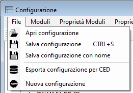</img>

|   |   |
| - | - |
| Apri configurazione | Permette di selezionare una configurazione da modificare |
| Salva configurazione | Salva le modifiche fatte |
| Salva configurazione con nome | Salva la configurazione con un altro nome |
| Esporta configurazione per CED | Esporta la configurazione in un formate testuale (txt) e, al momento attuale, la salva negli appunti |
| Nuova configurazione | Genera una nuova configurazione vuota nella quale aggiungere in seguito i moduli/strumenti necessari |

<br>

##### Menù *Moduli*

</img>

Elenco di moduli e strumenti disponibili, selezionare un modulo per aggiungerlo alla configurazione.

<br>

##### Menù *Proprietà Moduli*

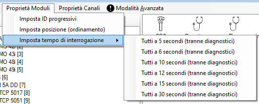</img>

|   |   |
| - | - |
| Imposta ID progressivi | Utilizzato come riferimento per i moduli di taratura |
| Imposta posizione (ordine) | Imposta gli ID dei moduli secondo la posizione attuale |
| Imposta tempo di interrogazione | Imposta il tempo (in secondi) di interrogazione dei moduli (eccetto i diagnostici) |

<br>

##### Menù *Proprietà Canali*

</img>

|   |   |
| - | - |
| Imposta decimali | Imposta i decimali di tutti i parametri in base alla sotto selezione del menù <br></img> |
| Imposta media | Imposta lo stesso tempo di integrazione a tutti i parametri in secondi <br></img> |
| Imposta diagnostici minimo percentuale dati | Imposta il valore minimo dei dati in percentuale <br></img> |
| Imposta gli ID progressivi | Imposta gli ID progressivi secondo l’ordine visivo |
| Imposta gli ID e DatabaseID progressivi (Tranne diagnostici) | Imposta gli ID ed i DatabaseID progressivi fatta eccezione per i diagnostici<br> ***Da non usare con una configurazione con i DatabaseID già impostati secondo il database del CED!*** |
| Imposta gli ID e DatabaseID progressivi (Tutti)  | Imposta gli ID ed i DatabaseID progressivi |
| Imposta i diagnostici | Per i diagnostici, il salvataggio dei dati in CSV è disabilitato di default (*False*) <br></img> |

<br>

#### 3.1.2 La Configurazione

Ogni qualvolta una configurazione viene salvata il programma mantiene uno storico delle modifiche in modo da poter recuperare una configurazione funzionante in caso di problemi.</img>

Occorre ***modificare tutti i parametri necessari*** al fine di configurare al meglio la strumentazione.<br>
Cliccare su un’impostazione qualsiasi delle tre liste per modificarne le proprietà. Salvare la configurazione a fine lavoro.

##### Configurazione del datalogger

</img>

|   |   |
| - | - |
| <u>***Configurazione***</u> |   |
| Header file dati | Header dei file dati per il centro (ammessi caratteri minuscoli, numeri,  tratto alto -, tratto basso _ ) |
| Nome del datalogger | Nome del datalogger, qualsiasi testo |
| <u>***Dati***</u> |   |
| Crea file compresso | Crea un file dati per il centro compresso |
| Formato nome file | Formato del nome del file per il centro, se solo HEADER, crea un file univoco in append |
| <u>***Avanzate***</u> |   |
| Crea files pipes (Slave) | Crea i files dati per alimentare le pipes usate da una seconda istanza del software, modalità Slave |
| <u>***Proprietà***</u> |   |
| Minimo spazio disco libero | Minimo spazio libero sul disco C: (GB) sotto il quale viene impostato l'alarme "Spazio disco in esaurimento" |

<br>

##### Configurazione del modulo

In seguito ***selezionare lo strumento che si vuole configurare***, compariranno le seguenti impostazioni da inserire:

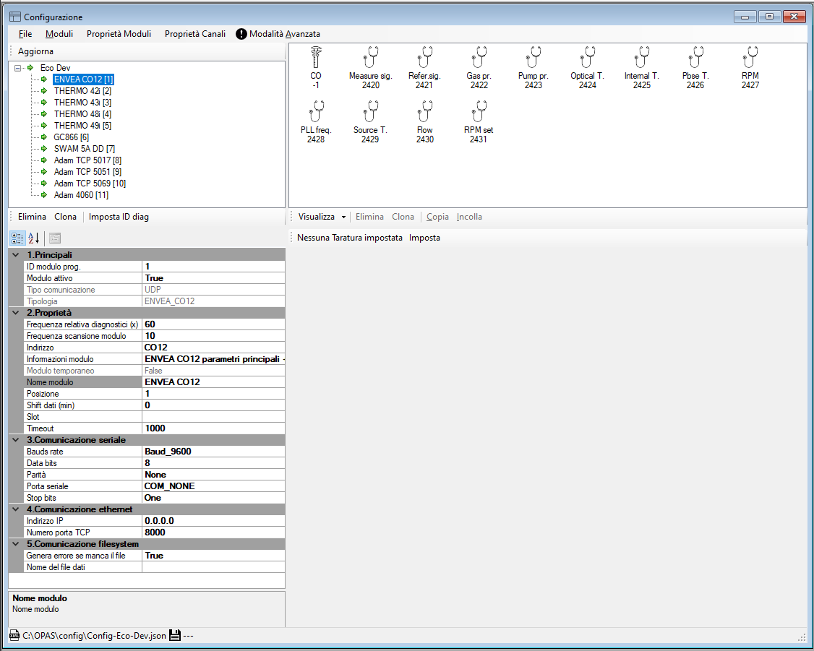</img>

|   |   |
| - | - |
| <u>***Principali***</u> |   |
| ID modulo prog. | ID univoco del modulo, progressivo |
| Modulo attivo | Modulo attivo si/no |
| Tipo comunicazione | Comunicazione modulo, seriale, tcpip ecc... |
| Tipologia | Tipologia modulo |
| <u>***Proprietà***</u> |   |
| Frequenza relativa diagnostici (x) | Frequenza scansione dei diagnostici rispetto alla scansione principale, da eseguire ogni x letture |
| Frequenza scansione modulo | Frequenza scansione del modulo in secondi |
| Indirizzo | Indirizzo del modulo, se utilizzato (1, 2, ...) |
| Informazioni modulo | Informazioni modulo, diagnostici ecc... |
| Modulo temporaneo | Se il modulo è temporaneo non salva la media per il CED, utile per strumenti temporanei |
| Nome modulo | Nome modulo |
| Posizione | Posizione – ordinamento del modulo |
| Shift dati (min) | Tempo di shift in minuti rispetto alla media oraria dei dati acquisiti (usato per GC866)  |
| Slot | Posizione dello slot in cui è inserito il modulo (usato per ADAM 5000 ; primo slot = 1) |
| Timeout | Timeout risposta dallo strumento in millisecondi |
| <u>***Comunicazione seriale***</u> |   |
| Bauds rate | Bauds porta seriale |
| Data bits | Data bits porta seriale |
| Parità | Parità porta seriale |
| Porta seriale | Nome porta seriale (COM1, COM2, ...) |
| Stop bits | Stop bits porta seriale |
| <u>***Comunicazione ethernet***</u> |   |
| Indirizzo IP | Indirizzo IP dello strumento |
| Numero porta TCP | Numero porta TCP della socket |
| <u>***Comunicazione filesystem***</u> |   |
| Genera errore se manca il file | Genera errore se manca il file, se impostato a *True* verrà incrementato il conteggio delle letture errate; (da impostare a *False* nel caso di SRI con una sola lettura nella mezz'ora) |
| Nome del file dati | Nome del file dati esterno da utilizzare come pipe in input |

<br>

##### Configurazione del parametro

Infine cliccare sul parametro che vogliamo impostare, compariranno le seguenti proprietà:

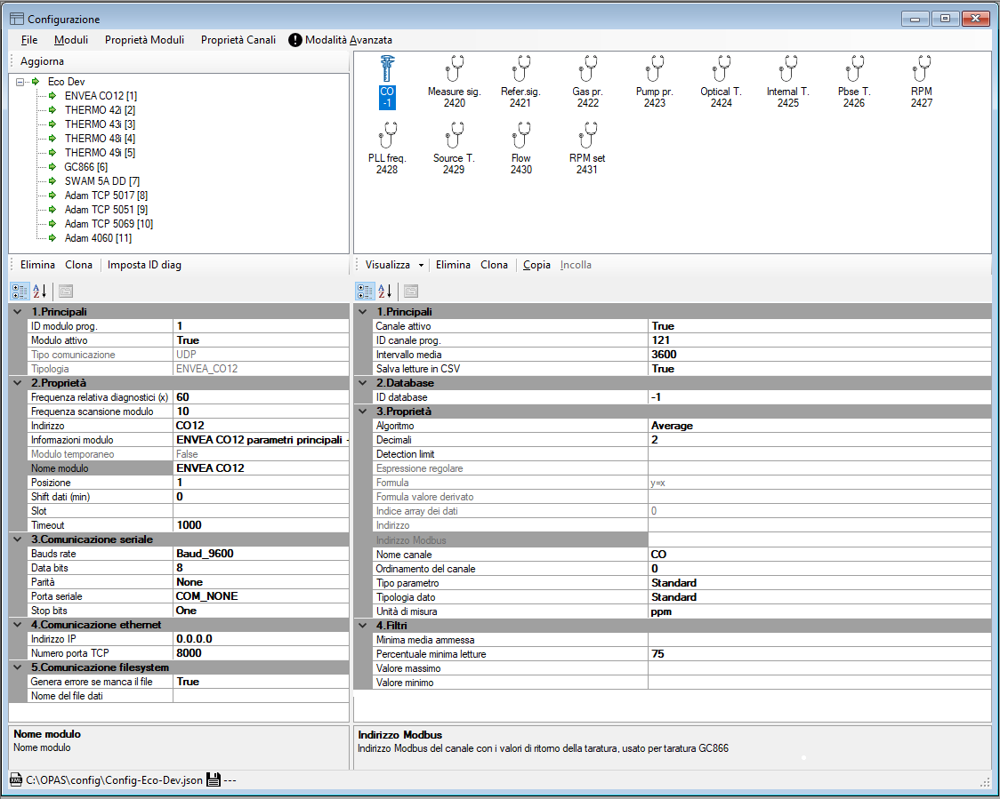</img>

|   |   |
| - | - |
| <u>***Principali***</u> |   |
| Canale attivo | Canale attivo si/no |
| ID canale prog. | Id univoco del canale, progressivo |
| Intervallo media | Intervallo della media in secondi |
| Salve letture in CSV | Salva tutte le singole letture (valori istantanei) in un file CSV |
| <u>***Database***</u> |   |
| ID database | ID univoco del canale utilizzato dal database per identificare il parametro |
| <u>***Proprietà***</u> |   |
| Algoritmo | Algoritmo di misura del canale (media, somma, ecc) |
| Decimali | Numero decimali per l’arrotondamento |
| Detection limit | Detection limit del parametro, il valore mediato verrà salvato pari alla metà del valore impostato C |
| Espressione regolare | Espressione regolare utilizzata per estrarre il valore dalla risposta dello strumento |
| Formula | Formula correttiva da applicare al valore grezzo |
| <a id="for-val-der" />Formula valore derivato | Formula per calcolare il dato finale partendo da due canali del modulo; ad esempio canali #1 e #2 => y=x1-x2 |
| Indice array dei dati | Indice nell’array dei dati acquisiti dal modulo con primo elemento pari a 0 |
| Indirizzo | Indirizzo/Etichette/ID del canale, usato per diagnostici, BTX, SRI e Modbus. L’etichetta corrisponde al nome nel file RES |
| Indirizzo Modbus | Indirizzo Modbus del canale con i valori di ritorno della taratura (usato per taratura GC866) |
| Nome canale | Nome del canale |
| Ordinamento del canale | Ordinamento del canale, solo come visualizzazione |
| Tipo parametro | Tipologia del parametro, regola in quale finestra del datalogger compare <br> &nbsp;&nbsp;&nbsp;&nbsp;&nbsp;- Standard (compare nel tab [*Principali*](#tab-principali) di OPAS-DL) <br> &nbsp;&nbsp;&nbsp;&nbsp;&nbsp;- Diagnostic (compare nel tab [*Diagnostici*](#tab-diagnostici) di OPAS-DL) <br> &nbsp;&nbsp;&nbsp;&nbsp;&nbsp;- Alarm (compare nel tab [*Allarmi*](#tab-allarmi) di OPAS-DL) <br> &nbsp;&nbsp;&nbsp;&nbsp;&nbsp;- Hidden (Rimangono nascosti e vengono utilizzati come parametri di supporto nelle tarature del GC866) |
| Tipologia dato | Tipologia del dato, normale o derivato da altri parametri <br> &nbsp;&nbsp;&nbsp;&nbsp;&nbsp;- Standard (Dato normale)<br> &nbsp;&nbsp;&nbsp;&nbsp;&nbsp;- Dependent (Dato derivato da altri parametri tramite [*formula valore derivato*](#for-val-der)) |
| <u>***Filtri***</u> |   |
| Minima media ammessa | Minimo valore mediato accettato, oltre al quale il dato viene automaticamente invalidato |
| Percentuale minima letture | Percentuale minima numero di misure valide (75%) |
| Valore massimo | Massimo valore istantaneo accettato, oltre al quale viene scartato dalla media |
| Valore minimo | Minimo valore istantaneo accettato, oltre al quale viene scartato dalla media |

<br>

##### Configurazione della taratura

</img>

Per impostare una taratura automatica, cliccare su “Imposta” </img> e compariranno le seguenti proprietà della taratura:

</img>

|   |   |
| - | - |
| <u>***Principali***</u> |   |
| Attiva | Taratura attiva si /no |
| Automatica | Taratura automatica si/no |
| Data fine taratura | Data fine taratura |
| Data inizio taratura | Data inizio taratura |
| Finestra ore attive | Ore in cui effettuare la taratura |
| Tempo di stabilizzazione (min) | Tempo di stabilizzazione della misura dopo lo Span in minuti |
| Tempo minimo runtime (ore) | Tempo minimo di runtime del programma a seguito di un riavvio del sistema (mancanza corrente) in ore |
| Tempo ripetizione ciclica (ore) | Tempo ripetizioni ciclica se diverso da zero in ore |
| <u>***Zero***</u> |   |
| Durata lettura di Zero (min) | Tempo durata lettura di Zero in minuti |
| Stabilizzazione dello Zero (min) | Tempo di stabilizzazione dello Zero in minuti |
| Valore di riferimento Zero () (unità ing.) | Valore di riferimento Zero (unità ing.) |
| <u>***Span***</u> |   |
| Duranta lettura di Span (min) | Tempo durata lettura di Span in minuti |
| Stabilizzazione dello Span (min) | Tempo di stabilizzazione dello Span in minuti |
| Tolleranza Span (%) | Tolleranza del valore di Span in percentuale |
| Valore di riferimento Span | Valore di riferimento Span (unità ing.) |
| Valore di riferimento Span Multiplo | Valore di riferimento Span Multiplo (unità ing.) |
|| Una volta cliccato il campo di Span Multiplo, verrà aperta la seguente finestra dove sarà possibile aggiungere i 5 elementi cliccando il pulsante "Aggiungi" uno alla volta:<br></img><br>Una volta aggiunto l'elemento, sarà possibile inserire il valore di taratura come nella seguente immagine: <br></img><br>Una volta confermato con il pulsante "OK", nella tabella iniziale sarà possibile visualizzare, cliccando sulla freccia posta a lato del campo (vedi immagine seguente), l'array dei valori appena inseriti:<br></img> |
| <u>***Banco taratura***</u> |   |
| ID modulo i/o | ID del modulo i/o (4060/6068) |
| Maschera relè per Span | Maschera dei relè valvola/e di Span su scheda ADAM 40xx/50xx da chiudere per effettuare lo SPAN |
| Maschera relè per Zero | Maschera dei relè valvola/e di Zero su scheda ADAM 40xx/50xx da chiudere per effettuare lo ZERO |
|| </img><br></img> |
| Utilizza banco di taratura | Utilizza banco di taratura composto da elettrovalvole pilotate da contatti i/o dei moduli ADAM 4000/5000<br> &nbsp;&nbsp;&nbsp;&nbsp;&nbsp;- None (nessun banco di taratura) <br> &nbsp;&nbsp;&nbsp;&nbsp;&nbsp;- OnlyBench (solo banco di taratura) <br> &nbsp;&nbsp;&nbsp;&nbsp;&nbsp;- InstrumentAndBench (invio comando allo strumento e gestione banco di taratura) |

<br>

Per eliminare la taratura cliccare su Elimina

</img>

### 3.2 File - Grafici

Maschera per analizzare lo storico dei dati acquisiti nella stazione, aprendo una configurazione è possibile caricare i dati storici di ogni parametro e visualizzarli sia come grafico che come tabella.<br>
Cliccare su ***Apri configurazione*** per selezionare la configurazione desiderata

</img>

Verranno visualizzati gli strumenti disponibili, ***selezionare lo strumento*** interessato

</img>

Dopo aver selezionato lo strumento ***selezionare, attraverso le checkbox, il parametro, o i parametri***, di cui si vuole generare il grafico tra quelli visualizzati nell’apposito riquadro:

</img>

***Selezionare le date*** di inizio e di fine tenendo presente che non è consentito avere un intervallo di date maggiore ai 6 mesi

</img>

Se si dovesse accidentalmente selezionare un intervallo di date superiore ai 6 mesi verrà mostrato un ***messaggio di avviso***

</img>

L’opzione ***Asse Y zero automatico*** è utile per posizionare il grafico con il valore minimo a 0 sull’asse delle Y, se non selezionata il grafico verrà centrato automaticamente in base ai valori rilevati

</img>

Cliccare il pulsante </img> per visualizzare il grafico e i dati del parametro selezionato nel range di date indicato, nel caso di modifiche alle impostazioni selezionate in precedenza si dovrà cliccare nuovamente sul pulsante per aggiornare il grafico

Verrà mostrato il ***grafico*** e la ***tabella dei dati*** riferita allo stesso

</img>

</img>

***Il significato delle colonne del quadro è il seguente:***

|   |   |
| - | - |
| Data | Data e ora di acquisizione del dato |
| Parametro* | Valore calcolato come media dei valori acquisiti durante l’ora specificata nel campo data riferiti al parametro selezionato (*nell’esempio “MCZ Temp”) |
| Minimo | Valore minimo rilevato durante l’ora di acquisizione |
| Massimo | Valore massimo rilevato durante l’ora di acquisizione |
| Codice | Codice di validità (vedi capitolo 6.1) |
| Percentuale | Percentuale di dati validi durante l’ora di rilevazione |

<br>

### 3.3 File - Tarature

Maschera per analizzare i risultati acquisiti durante la taratura degli strumenti, aprendo una configurazione è possibile visualizzarne i dati nella tabella<br>
Cliccare su ***Apri configurazione*** per selezionare la configurazione desiderata

</img>

***Selezionare le date*** di inizio e di fine tenendo presente che non è consentito avere un intervallo di date maggiore ai 6 mesi

</img>

Se si dovesse accidentalmente selezionare un intervallo di date superiore ai 6 mesi verrà mostrato un ***messaggio di avviso***

</img>

Cliccare il pulsante </img> per visualizzare i dati relativi ai risultati delle tarature di tutti i parametri attivi relativi alla configurazione selezionata

</img>

***Il significato delle colonne del quadro è il seguente:***

|   |   |
| - | - |
| Data | Data e ora di acquisizione del dato |
| Parametro | Nome del parametro oggetto della taratura |
| Modalità | Modalità di taratura del parametro ZERO o SPAN |
| Tipo taratura | Specifica la tipologia di taratura se automatica o manuale |
| Tolleranza | Valore di tolleranza riferito al parametro e alla modalità (ZERO o SPAN) |
| Risultato | Risultato della taratura basato sulla modalità<br>ZERO: OK, ZERO LOW, ZERO HIGH<br>SPAN: OK, SPAN LOW, SPAN HIGH |
| Valore | Valore restituito come risultato della taratura |

<br>
<br>
<br>

## 4 OPAS-DL 

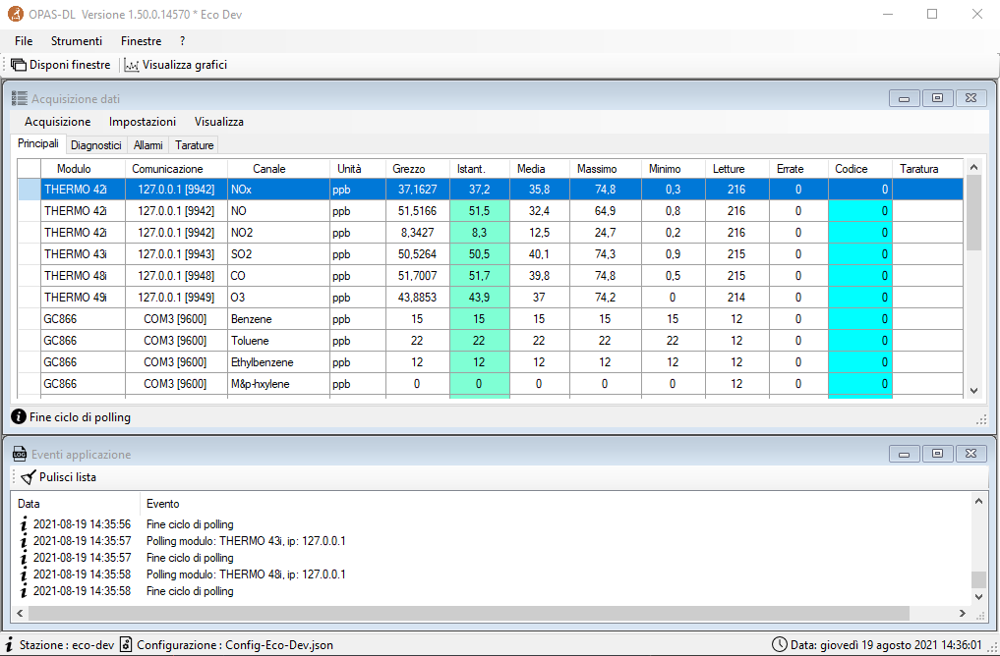</img> 

Il software OPAS DL viene utilizzato ***per acquisire i dati*** utilizzando una configurazione creata con OPAS TOOL.
Al primo avvio crea in automatico la struttura delle directory necessarie al corretto funzionamento del sistema.

<br>

### 4.1 Software di acquisizione

Il programma è stato creato con una ***interfaccia principale che racchiude le diverse finestre*** per praticità di utilizzo. Il modulo principale racchiude tre schede: principali, diagnostici, tarature che vengono descritti qui di seguito.

Al primo avvio del programma, assicurarsi che, nel file C:\OPAS\OPAS-DL.ini, sia presente la linea relativa al proprio file di configurazione:

</img>

<br>

### 4.2 Form contenitore

</img>

#### 4.2.1 I menù

##### Menu *File*

</img>

|   |   |
| - | - |
| Visualizza eventi applicazione | Visualizza gli eventi registrati nei files di log |
| Visualizza dati in tempo reale | Apre il modulo dei dati istantanei (vedi [*Visualizzazione tabellare*](#visualizzazione-tabellare)) |
| Visualizza grafici in tempo reale | Apre il modulo dei grafici in real time (vedi [*Visualizzazione grafica*](#visualizzazione-grafica)) |
| Visualizza configurazione | Visualizza la configurazione in uso in un modulo in sola lettura (vedi [*Visualizza configurazione*](#visualizza-configurazione)) |
| Visualizza file di log | Visualizza il contenuto del file di log scelto in base alla data <br></img> |
| Apri file di log in Notepad | Visualizza il contenuto del file di log nell'applicazione Notepad <br></img> |
| Apri coda file di log (PS) | Visualizza la coda del file di log, in continuo aggiornamento, all'interno di una finestra Windows Powershell <br>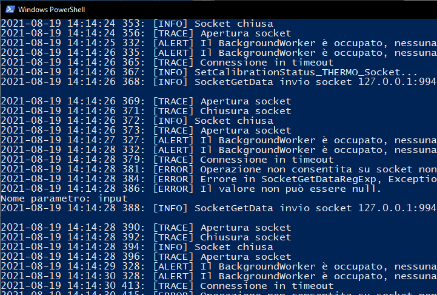</img> |
| Esci | Chiude l'applicazione OPAS-DL |

<br>

##### Menù *Strumenti*

</img>


|   |   |
| - | - |
| Modifica configurazione | Vedi [*3.1 File - Configurazione*](#31-file---configurazione) |
| Visualizza storici grafici | Vedi [*3.2 File - Grafici*](#32-file---grafici) |
| Visualizza storici tarature | Vedi [*3.3 File - Tarature*](#33-file---tarature) |
| Riavvia OPAS-DL | Esegue il riavvio del programma |
| Aggiorna OPAS-DL | Esegue l’aggiornamento del programma |

<br>

##### Menù *Finestre*

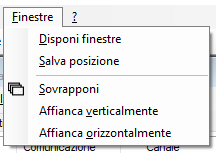</img>


|   |   |
| - | - |
| Disponi finestre | Dispone le finestre in modo ottimale |
| Salva posizione | Salva la posizione corrente delle finestre |
| Sovrapponi | Sovrappone le finestre |
| Affianca verticalmente | Le affianca verticalmente |
| Affianca orizzontalmente | Le affianca orizzontalmente |

<br>

##### Menù *Help*

</img>


|   |   |
| - | - |
| Changelog | File contenente le modifiche apportate ad ogni aggiornamento del software <br>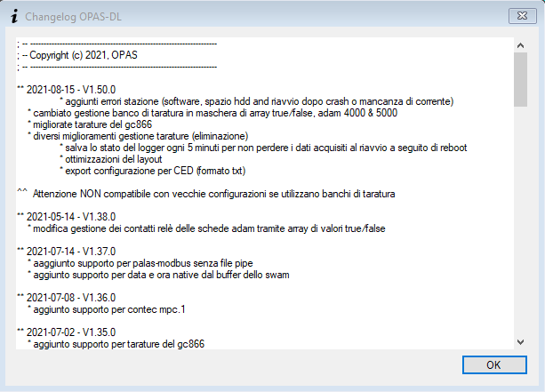</img> |
| Informazioni … | Informazioni sul software e la sua versione <br></img> |

<br>


#### 4.2.2 Barra inferiore

</img> 

Nella barra inferiore dell’applicazione vi è un piccolo menu che indica i seguenti parametri:

|   |   |
| - | - |
| Stazione | Stazione di riferimento del programma utile in caso di OPAS DL multipli |
| Configurazione | File di configurazione in uso |
| Data | Data e ora correnti |

<br>

### 4.3 Acquisizione dati

</img> 

#### 4.3.1 I menù

##### Menù *Acquisizione*

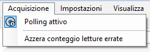</img>

Polling attivo	Attiva o disattiva il polling. In modalità disattivata le porte seriali vengono chiuse, permettendo di interfacciarsi agli strumenti con altri software di gestione
Azzera conteggio letture errate	Ripristina il numero delle letture errate nella scheda “Principali”

<br>

##### Menù *Impostazioni*

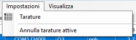</img>

|   |   |
| - | - |
| Tarature | Vedi [*Visualizzazione tarature*](#visualizzazione-tarature) |
| Annulla tarature attive | Elimina tutte le tarature attive |

##### Menù *Visualizza*

</img>

|   |   |
| - | - |
| Normale | Vengono nascoste le colonne ID, Stato e Stazione  |
| Compatto | Vengono nascoste le colonne ID, Comunicazione, Stato, Grezzo e Stazione |
| Esteso | Vengono visualizzate tutte le colonne |

Nella seguente immagine viene visualizzato il formato Esteso:

</img>

##### Visualizzazione tarature

</img>

Il modulo Tarature permette di ***gestire le tarature manuali ed automatiche dell’acquisitore***. Selezionando uno strumento dalla lista si può aggiungere una taratura programmata, impostandone la tipologia (Zero o Span), i tempi di durata della stabilizzazione, dei cicli di zero e span e la data/ora di esecuzione della taratura. Nel caso di taratura automatica questa verrà posticipata in automatico del numero di ore impostato nel campo di ripetizione ciclica.

</img>

<br>

#### 4.3.2 I tab

##### Tab *Principali*

Lista degli strumenti e parametri in polling con visualizzazione dei dati principali, aggiornati ad ogni ciclo

</img>

***Il significato delle colonne del quadro è il seguente:***

|   |   |
| - | - |
| Modulo | Nome del modulo/strumento |
| Comunicazione | Proprietà porta seriale o connessione ethernet |
| Canale | Nome canale o parametri |
| Unità | Unità di misura |
| Grezzo | Valore grezzo acquisito dallo strumento |
| Istantaneo | Ultimo dato acquisito applicando la formula al valore grezzo |
| Media | Media dei valori acquisiti |
| Massimo | Massimo valore acquisito |
| Minimo | Minimo valore acquisito |
| Letture | Numero di misure totali |
| Errate | Numero di misure errate |
| Codice | Codice di validità (vedi capitolo 6.1) |
| Taratura | Fase della taratura, zero, span, purge |

<br>

Cliccando con il tasto destro del mouse sull'header di una riga (prima colonna della tabella, quella a sinistra di "Modulo") è possibile impostare uno stato o una taratura al modulo corrispondente. Inoltre è possibile anche reperire l'indirizzo IP e le info del modulo selezionato.
Verrà associata un'icona alla riga in base all'azione selezionata:

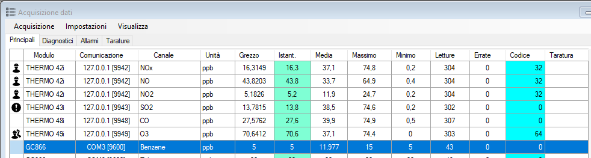</img>

|   |   |
| - | - |
| Stato modulo | Stato del modulo <br></img> <br> - Online (default, in acquisizione) <br> - Disattivato (modulo non più in acquisizione, ma non viene variato il codice) <br> - Manutenzione ordinaria (si applica il codice 32) <br> - Manutenzione straordinaria (si applica  il codice 32) |
| Taratura | Taratura che si vuole applicare <br></img> <br> - Zero (esegue una taratura di Zero) <br> - Span (esegue una taratura di Span) <br> Una volta terminata la taratura, aprire nuovamente questo menù e cliccare su 'Sample'. Il modulo tornerà ad acquisire normalmente |
| Varie | In 'Varie' è possibile recuperare l'indirizzo IP e le info del modulo <br></img> |

<br>

##### Tab *Diagnostici*

Lista dei parametri diagnostici finalizzata a separare questi ultimi da quelli operativi

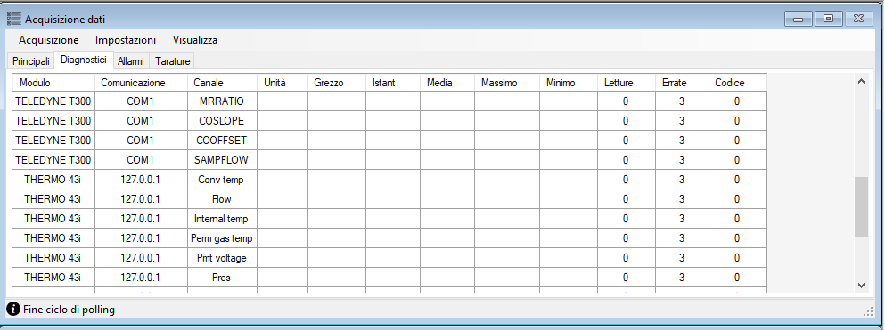</img>

***Il significato delle colonne del quadro è il seguente:***

|   |   |
| - | - |
| Modulo | Nome del modulo/strumento |
| Comunicazione | Proprietà porta seriale o connessione ethernet |
| Canale | Nome canale o parametri |
| Unità | Unità di misura |
| Grezzo | Valore grezzo acquisito dallo strumento |
| Istantaneo | Ultimo dato acquisito applicando la formula al valore grezzo |
| Media | Media dei valori acquisiti |
| Massimo | Massimo valore acquisito |
| Minimo | Minimo valore acquisito |
| Letture | Numero di misure totali |
| Errate | Numero di misure errate |
| Codice | Codice di validità (vedi capitolo 6.1) |

<br>

##### Tab *Allarmi*

Lista degli allarmi

</img>

***Il significato delle colonne del quadro è il seguente:***

|   |   |
| - | - |
| Modulo | Nome del modulo/strumento |
| Comunicazione | Proprietà porta seriale o connessione ethernet |
| Canale | Nome canale o parametri |
| Unità | Unità di misura |
| Grezzo | Valore grezzo acquisito dallo strumento |
| Istantaneo | Ultimo dato acquisito applicando la formula al valore grezzo |
| Media | Media dei valori acquisiti |
| Massimo | Massimo valore acquisito |
| Minimo | Minimo valore acquisito |
| Letture | Numero di misure totali |
| Errate | Numero di misure errate |
| Codice | Codice di validità (vedi capitolo 6.1) |

<br>

##### Tab *Tarature*

Lista dei parametri in taratura

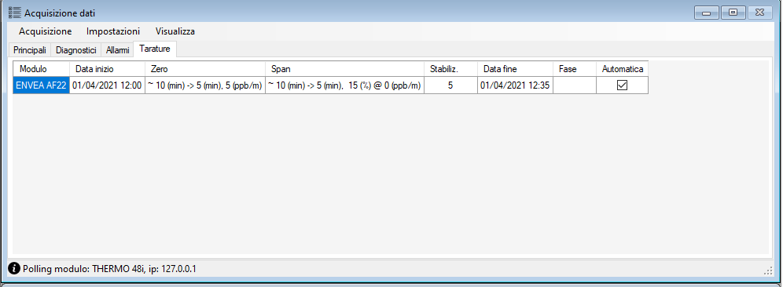</img>

***Il significato delle colonne del quadro è il seguente:***

|   |   |
| - | - |
| Modulo | Nome del modulo |
| Data inizio | Data inizio taratura manuale o automatica |
| Zero | Tempo di lettura, tempo di stabilizzazione, percentuale tolleranza e valore di defect |
| Span | Tempo di lettura, tempo di stabilizzazione, percentuale tolleranza e valore di defect |
| Stabiliz. | Tempo finale di stabilizzazione (purge) |
| Data fine | Data fine taratura manuale o automatica |
| Fase | Indica se il parametro è in uno stato di Zero, Span o Purge (tempo di stabilizzazione) |
| Automatica | Checkbox per verificare se la taratura è automatica |

<br>


### 4.4 Eventi applicazione

</img>

In questa finestra verranno visualizzati tutti gli eventi relativi ai moduli in acquisizione.<br>Cliccando il pulsante 'Pulisci lista' la finestra verrà svuotata di tutti i log. 

### 4.5 Visualizzazione tabellare

</img>

Il modulo visualizzazione dati ***utilizza una tabella aggiornata in tempo reale***. Come per i grafici si possono selezione di parametri da visualizzare. Cliccare su “Attivo” per iniziare ad acquisire i dati.

<br>

### 4.6 Visualizzazione grafica

</img>

Il modulo dei grafici ***permette di plottare in tempo reale i dati acquisiti dagli strumenti***. E’ possibile impostare il tipo delle scale, dell’area dei grafici, il tempo di durata dell’asse delle date e la selezione di parametri da visualizzare. Cliccare su “Attivo” per iniziare ad acquisire i dati.

</img>

<br>

### 4.7 Visualizza configurazione

</img>

Il modulo “Visualizza configurazione” permette di ***visualizzare la configurazione della stazione***, ma in sola modalità di lettura.

<br>

## 5 APPENDICE A 

### 5.1 Codici di validazione

<table>
<thead>
  <tr>
    <th >DL</th>
    <th >Descrizione</th>
    <th >CED</th>
    <th >Stato</th>
  </tr>
</thead>
<tbody>
  <tr>
    <td >0</td>
    <td >Valido</td>
    <td >0</td>
    <td >Valido</td>
  </tr>
  <tr>
    <td >1</td>
    <td >Valore dello Span minore del limite calcolato in base alla tolleranza</td>
    <td  rowspan="4">-16</td>
    <td >Non valido</td>
  </tr>
  <tr>
    <td >2</td>
    <td >Valore dello Span maggiore del limite calcolato in base alla tolleranza</td>
    <td >Non valido</td>
  </tr>
  <tr>
    <td >4</td>
    <td >Valore dello Zero minore del limite calcolato in base alla tolleranza</td>
    <td >Non valido</td>
  </tr>
  <tr>
    <td >8</td>
    <td >Valore dello Zero maggiore del limite calcolato in base alla tolleranza</td>
    <td >Non valido</td>
  </tr>
  <tr>
    <td >16</td>
    <td >Taratura</td>
    <td >2</td>
    <td >Valido</td>
  </tr>
  <tr>
    <td >32</td>
    <td >Manutenzione Ordinaria</td>
    <td  rowspan="2">-64</td>
    <td  rowspan="2">Non valido</td>
  </tr>
  <tr>
    <td >64</td>
    <td >Manutenzione Straordinaria</td>
  </tr>
  <tr>
    <td >128</td>
    <td ><span style="font-weight:400;font-style:normal">Misura non valida causa numero di letture inferiore al 75% di copertura</span></td>
    <td >-4</td>
    <td >Non valido</td>
  </tr>
  <tr>
    <td >256</td>
    <td >Errore dello strumento letto dal flag di status</td>
    <td >-32</td>
    <td >Non valido</td>
  </tr>
  <tr>
    <td >512</td>
    <td >Misura compresa tra + e – detection limit</td>
    <td >4</td>
    <td >Valido</td>
  </tr>
  <tr>
    <td >1024</td>
    <td >Misura inferiore a - detection limit</td>
    <td >-8</td>
    <td >Non valido</td>
  </tr>
  <tr>
    <td >2048</td>
    <td >Misura istantanea inferiore al minimo ammesso</td>
    <td  rowspan="3">/</td>
    <td  rowspan="3"><span>Da definire</span></td>
  </tr>
  <tr>
    <td >4096</td>
    <td ><span>Misura istantanea superiore al massimo ammesso</span></td>
  </tr>
  <tr>
    <td >8192</td>
    <td >Misura istantanea oltre la variazione ammessa</td>
  </tr>
</tbody>
</table>

### 5.2 Codici di stazione

| DL | Descrizione | CED | Descrizione |
| - | - | - | - |
| 0 | Situazione normale e funzionante, senza anomalie | 0 | Valido |
| 1 | Errore generico software | 0 | Valido |
| 2 | Riavvio del sistema | 0 | Valido |
| 4 | Spazio su disco in esaurimento | 0 | Valido |

<br>
<br>
<br>

## 6 APPENDICE B

### 6.1 Opzioni di configurazione del programma

#### File *OPAS-DL.ini*

Di seguito un ***esempio di file di configurazione del software*** ed una descrizione delle varie opzioni.

|   |   |
| - | - |
| “schermo-intero” | Se impostato a “true” il programma parte a schermo intero |
| “form-posizione” e “form-dimensione” | Vengono impostati automaticamente dal software cliccando su “Finestre > Salva posizione” |
| “finestra-eventi” | Se impostato a “true” viene visualizzata la finestra degli eventi allo startup |
| “dati-moduli-ritardo” | Minuti oltre i quali a seguito di un riavvio, non viene più utilizzato lo snapshot salvato |
| “programma-aggiornamento” | Programma da avviare per effettuare l’aggiornamento dei software. Normalmente vendono scaricati da un repository FTP |
| “seconda-istanza” | Se impostato a false è possibile eseguire una sola istanza del programma |
| “livello-log” | Determina la verbosità del log del software |
| “configurazione” | Nome della configurazione salvata nella directory “config” |

[Opzioni]

* ; visualizza l'applicazione a schermo intero

    schermo-intero = false

* ; posizione X,Y

    form-posizione = 93,27

* ; dimensione W,H

    form-dimensione = 1013,788

* ; visualizza/nasconde la finestra eventi
    
    finestra-eventi = true

* ; massimo ritardo file dati moduli (moduli.json) in minuti per essere riutilizzato durante uno start-up

    dati-moduli-ritardo = 5

* ; programma esterno aggiornamento software

    programma-aggiornamento = OPAS-MANAGER.exe

* ; permette di avere una seconda istanza del programma

    seconda-istanza = false

* ; livello log<br>
  ; Info = 0   ' information<br>
  ; Alert = 1  ' alerts<br>
  ; Errors = 2  ' errors<br>
  ; User = 3   ' user actions<br>
  ; Command = 4 ' command to be sent<br>
  ; Debug = 5   ' debug infos<br>

    livello-log = 0

* ; file di configurazione in ./config/

    configurazione = Config-Sample.json

<br>
<br>
<br>

## 7 APPENDICE C

### CALCOLI

### 7.1 Deviazione standard

</img>

Con </img> media aritmetica

<br>

### 7.2 Velocità del vento scalare

</img>

Dove:

* </img>
* </img> componente ovest-est del vento
* 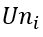</img> componente nord-sud del vento

<br>

### 7.3 Unità vettoriale media della direzione del vento

</img>

Dove:

* </img>
* 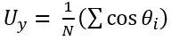</img>

<br>

### 7.4 Velocità del vento vettoriale:

</img>

Dove:

* </img>
* </img>

<br>

### 7.5 Direzione media del vento vettoriale

</img>

Con </img> e </img> definiti sopra

<br>

### 7.6 Detection limit

Il calcolo del limite di rilevabilità viene eseguito sulla base della media oraria (o altra integrazione secondo la configurazione) secondo la seguente logica tenendo conto delle seguenti variabili:

|   |   |
| - | - |
| DL | detection limit |
| X | valore della media oraria |
| C | codice di validità |

Se X < DL e X > -DL allora X = DL/2 ed il codice di validità viene impostato a 512 (Misura compresa tra + e – detection limit), dato valido

Se X < -DL allora il codice di validità viene impostato a 1024 (Misura inferiore a - detection limit), dato non valido

<br>
<br>
<br>

## 8 APPENDICE D 

### 8.1 Caratteristiche hardware

Il sistema OPAS DL è costituito da un ***microcalcolatore per applicazioni di tipo industriale***, basato su CPU standard e BUS ISA (PC-AT).

Essendo ***strutturato in modo totalmente modulare***, risulta liberamente espandibile sul piano hardware e configurabile in base alle necessità applicative.

OPAS DL, nella sua configurazione di base, è composto dai seguenti moduli con le caratteristiche minime:

* Unità di elaborazione basata su PC industriale;
* Microprocessore 1 GHz;
* 2 Gigabyte di memoria RAM;
* Interfaccia Ethernet 10 / 100 Mbps;
* 4 porte seriali RS-232 (dedicate all’acquisizione degli strumenti e/o dei moduli I/O);
* 4 porte USB (per ulteriori ingressi seriali);
* Hard Disk drive da 120 GB;
* Monitor LCD 17”;
* Sistema operativo: WINDOWS 7, WINDOWS 10 32/64 bits;
* Software di acquisizione dati;

***Schede Hardware di espansione del sistema:***

* Schede di acquisizione dati:
  * Advantech Serie 4000;
  * Acquisitori dati Campbell serie 1000 - 800 – 850;

<br>
<br>
<br>

## 9 APPENDICE E 

### 9.1 Setup Windows 10

***Nome utente***: Arpa

***Nome PC***: Arpa_NomeStazione - Psw: nessuna password

Cortana – digita: ***modifica data e ora***
Fuso orario: UTC + 1 – Passa automaticamente all’ora legale: DISATTIVATO (no check)

Cortana – digita: ***modifica risparmio energia***
Disattivazione schermo: 1 ora – Sospensione computer: MAI

***Disattivare l’ibernazione PC***

1. Fare clic su Start e digitare cmd nella casella Avvia ricerca;
2. Nell'elenco dei risultati della ricerca fare clic con il pulsante destro del mouse su       Prompt dei comandi, quindi fare clic su Esegui come amministratore;
3. Alla richiesta di Controllo dell'account utente, fare clic su Continua;
4. Al prompt dei comandi digitare powercfg.exe /hibernate off, quindi premere INVIO;
5. Digitare exit, quindi premere INVIO per chiudere la finestra del prompt dei comandi.

***Microsoft Edge (2020 Chromium)***: installare e applicare la seguente configurazione:

* “…” in alto a destra;
* “Impostazioni”;
* dall’elenco a sinistra: “All’avvio”;
* “Apri una pagina o pagina specifica”;
* “Aggiungi nuova pagina”;
* digitare “https://www.google.it/”;
* dall’elenco a sinistra: “Browser predefinito”;
* “Imposta come predefinito”;
* dall’elenco a sinistra: “Aspetto”;
* attivare “Mostra pulsante Home”;
* selezionare “Immetti URL” e digitare “https://www.google.it/”;
* dall’elenco a sinistra: “Privacy e servizi”;
* scorrere fino a “Servizi” e cliccare su “Barra degli indirizzi”;
* selezionare “Google” dal menu a tendina “Motore di ricerca utilizzato nella barra degli indirizzi”;
* selezionare “Barra degli indirizzi” dal menu a tendina “La ricerca in nuove schede usa la casella di ricerca o la barra degli indirizzi”;
* “Gestisci motori di ricerca”;
* su tutti, meno che su “Google”, cliccare i “…” e selezionare “Rimuovi”;

***Total commander***: installa ultima versione a 64bit. Installare solo l’italiano, non altre lingue.

***Notepad 3***: installare da https://www.rizonesoft.com/downloads/notepad3/ > impostazioni di default

***Teamviewer***: Scaricare ed installare per scopi privati/non commerciali. Dopo installato vai a Connessione > Imposta accesso automatico: inserire i dati (PC – PASSWORD) e poi ceccare: non desidero creare un account teamviewer adesso.

***Anydesk***: download e lanciare eseguibile senza installazione

***Python***: scaricare ed installare Python mettendo il check su “Add Python to Path”.

***NcFTP***: installa ultima versione di NcFtp. Scaricare dal sito https://www.ncftp.com/download/ e scaricare da NcFTP Client 3.2.6 for Microsoft Windows.

Ricerca – ***impostazioni di Windows Update*** – installare tutti gli aggiornamenti disponibili

***Disattivare gli aggiornamenti a windows 10***
Ricerca: cercare cmd.exe;
Dal prompt dei comandi lanciare: gpedit.msc – si apre una finestra (editor criteri gruppi locali);
Configurazione Computer > Modelli Amministrativi > Componenti di Windows > Windows Update;
Doppio click nella parte destra della finestra, su “Configura Aggiornamenti Automatici;
Spostare la prima spunta su “Attivata” -  dal menu a tendina selezionare la voce “2 – Avviso per download e installazione”. Cliccare su “Ok”

***Barra delle applicazioni***:
Eliminare icone store windows e outlook dalla barra delle applicazioni ed aggiungere Total Commander, Teamviewer e Notepad. Ridurre cortana ad icona tramite tasto destro sulla barra stessa.

<br>
<br>
<br>

## 10 APPENDICE F 

### 10.1 Setup DataLogger

#### Come installare OPAS su un computer di stazione della rete di monitoraggio della qualità dell’aria:

1. Decomprimere il file “setup.zip” ricevuto sotto “C:\”;<br>
   Dopo averlo decompresso vengono create 2 cartelle (OPAS e OPAS-SUPPORT) sotto C:\

   </img>

   La Cartella OPAS contiene 4 files

   </img>

   La Cartella OPAS-SUPPORT contiene 3 cartelle, 2 files .txt e un file.bat di startup

   </img>

2. Eseguire il file CreateStartupLinks che inserisce nella cartella di ‘Esecuzione automatica’ di Windows i link ai 2 applicativi: OPAS-DL e Cron

   </img>

   Questa operazione va eseguita solo la prima volta.
3. Lanciare il file OPAS MANAGER.exe presente nella cartella OPAS e successivamente cliccare il pulsante ‘Inizializza stazione’.

   </img>

4. Eseguire l’applicativo _Cron_ presente nella cartella OPAS-SUPPORT\Cron
5. Eseguire l’applicativo _OPAS-TOOLS_ presente nella cartella OPAS
6. Aprire finestra di ‘Configurazione’ la prima stazione.

   </img>

7. Creare una ‘Nuova configurazione’

   </img>

8. Compilare i campi della configurazione seguendo queste regole:

   </img>

* **Header file dati**: è il nome della stazione (deve essere ***minuscolo senza spazi*** con l’indicazione della provincia di appartenenza es: ao_piazza_plouves)
* **Nome del datalogger**: libera scelta<br>
  Lasciare gli altri campi con i valori preimpostati.

9. Salvare la configurazione assegnandole un nome (file di tipo .json).
10. Inserire nel file OPAS-DL.ini presente nella cartella OPAS il nome della configurazione appena salvata nell’ultima riga del file dove presente il campo ‘***configurazione=…***’
11. Creare i moduli per l’acquisizione degli strumenti.

    </img>

12. Configurare il modulo secondo l’installazione dello strumento (Porta seriale, ethernet…).
13. Selezionare la voce di menu ‘Proprietà CanaliImposta gli ID e DatabaseID progressivi (non diagnostici) per assegnare i codici identificativi dei parametri acquisiti.

    </img>

    <br>

    </img>

Questa operazione va eseguita su tutti i moduli.

<br>

### 10.2 Eccezione OPAS relativa a Windows Defender

Per impedire il malfunzionamento del programma OPAS-DL, è necessario generare un’eccezione all’interno dell’antivirus/firewall Windows Defender:

1. Digitare “protezione da virus e minacce” nella barra della ricerca;

   </img>

2. Cliccare su “Gestisci impostazioni”;

   </img>

3. Scorrere la pagina verso il basso fino alla sezione chiamata “Esclusioni”:

   </img>
   
4. Per aggiungere una o più esclusioni, premere il pulsante “+ Aggiungi un’esclusione” e selezionare il una delle opzioni visualizzate

   </img>

   Occorrerà creare l’esclusione per l’intera cartella C:\OPAS.

   Il risultato sarà il seguente:

   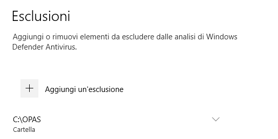</img>

<br>
<br>
<br>

##### [Torna all'inizio](#sommario)
